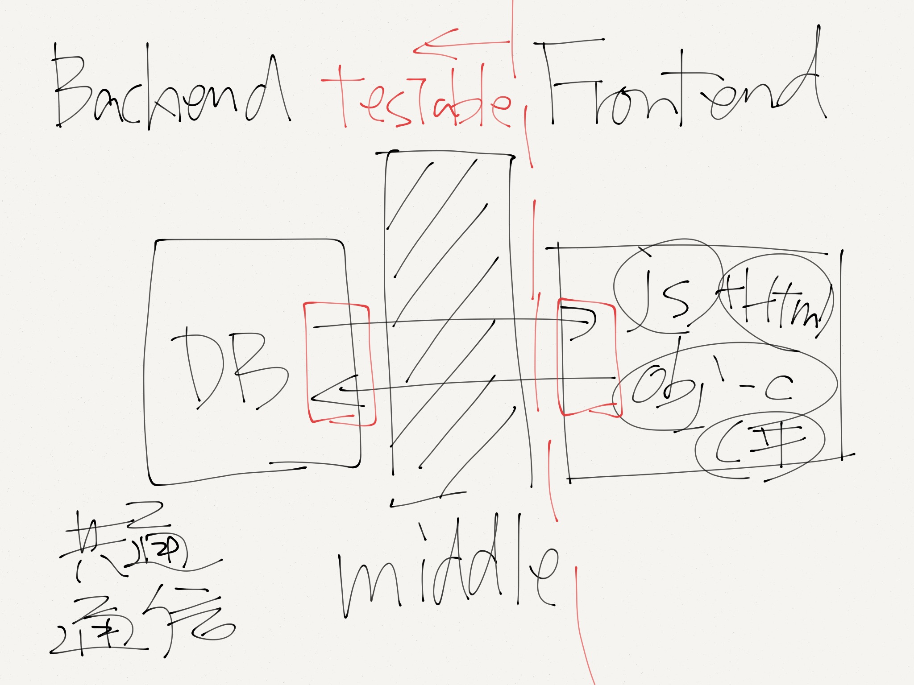
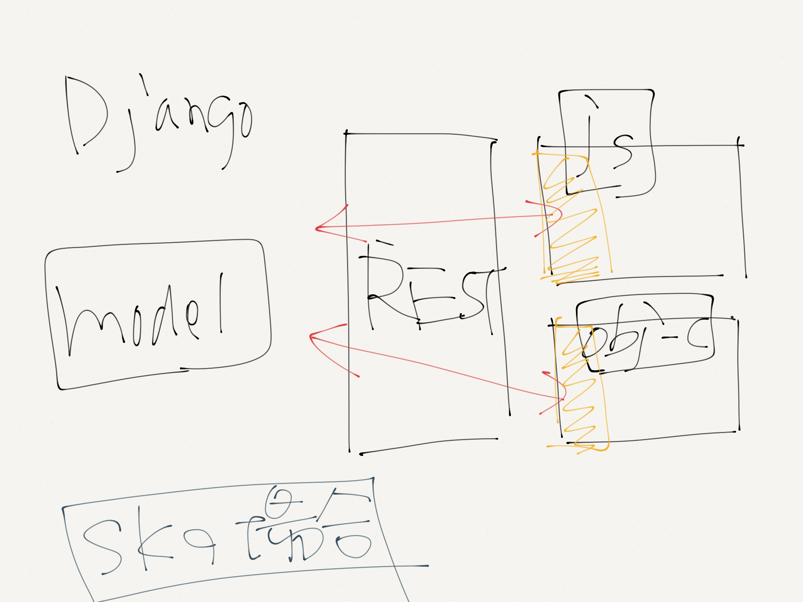
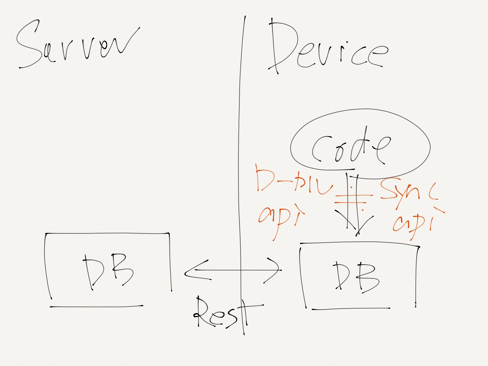

# RESTとデータ同期
naoki 2012/11/15

!

## middle(通信)を介したbackendとfrontendの分離

- 固く書きたい部分を守る
- テスタブル
- 分離の方針になる
- パフォーマンス、整合性などはバックエンドで担保
- apiによる

- （skではajax目的で開始)


!

## イメージ



!

## skの例



!

## skの例(コード)

- jsの場合のコード


```coffeescript
class Event extends utils.model.Model
    @endpoint: '/event/student/api'
    @modelname 'storage'

@events = app.model.Event.observableArray([])

@events {name__icontains: 'test'}, (val)=>
	console.log 'complete'
```
- iosの場合のコード


```objective-c

@implementation Event (sync)
+ (NSString *)restName{
    return @"storage";
}

+ (NSString *)restAppName{
    return @"event/student";
}
@end

[Event sync_filter:@{@"name__icontains": @"test"} options:nil complete:handler];
```

!


## skでの教訓

- RESTの自由度を上げすぎた
- django本体のtemplateと相性が悪い
- 特にvalidation
- authも自由すぎた

- middle周りの設計が「書きながら」すぎた．orz．


!

## skでの教訓(Ajax部分)

- スキーマやvalidationなどは固く書きたい
	- validationが二カ所に．
- SEO部分は静的
- クライアントサイドでのエラー検知
- ファイル分割などはdjango機能

!

## ここまでの考察

- RESTは設計によってまちまち
- どこまでをバックエンドとするのか
- 通信にはhttpを使う？
- （制限されたinterfaceだったら何でも）

!

## db同期

- iosの場合だと、デバイス上にもdb
- 透過的にアクセスできるAPI
- 裏で同期
	- updated_dateを使った同期

- 例

```objective-c
[Event filter:@{@"name__icontains": @"test"} options:nil complete:handler];
[Event sync_filter:@{@"name__icontains": @"test"} options:nil complete:handler];
```

!

## db同期



!

## db同期のアルゴリズム


!

## 教訓

- APIの自由度を上げない
	- 分かりやすい
	- パフォーマンスの担保

!

## 関係ありそうな話題