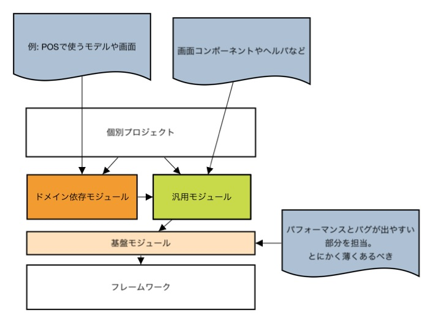
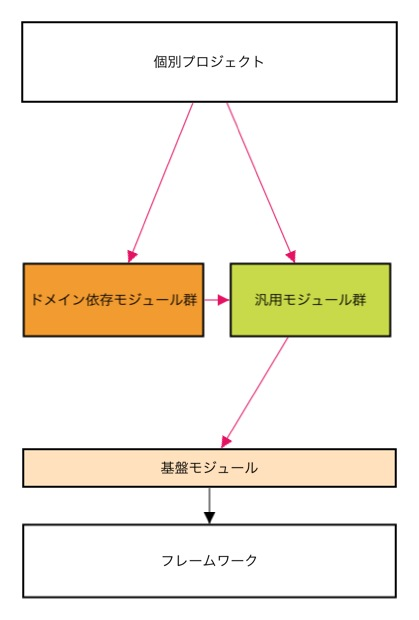
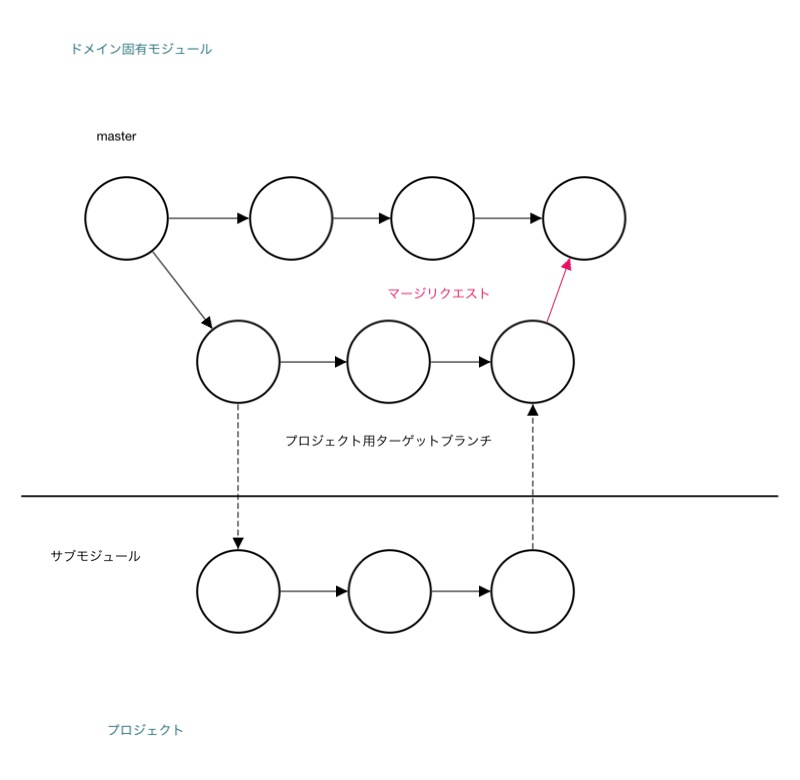

# 開発のスケール？
naoki 2012/11/08

!

# 会社公式のgithub作りました．

 - https://github.com/organizations/scubism
 - githubから一度folkしてきて色々と改変
 - 勉強会で使ったり．．
 - https://github.com/scubism/research_meeting
 - 外部公開に使ったり．．（未定）
 - そもそも使いやすい．wikiとかpull requestとか．

!

# 皆さんのgithubアカウント下さい．

 - yammerなぞに書いてくれれば入れておきます．

!
# さてgithub + gitlabを使った運用方法を考えようと思った

 - 作ったのはいいけれどどこにどーやって？
 - pull requestはどう活用する？
 - 
 - 触っていい部分、触らない部分はどう決める？？

!

# 考える基準を考える
 - ソースの分離、構造化
 - そもそもどんな「基準」？
 - プログラムの目的みたいなものに立ち返ってみる
 
  - そこから「テスト」や「構造化」、「パフォーマンス」etc
 が出てくるのが望ましい
  - どれが重要なのかが分かる．
 

!
# じゃぁ僕らのプログラムの目的とは？

!

# バグつぶし？
# パフォーマンス？
# 顧客満足？
# ユーザ体験？

どれも最終目標ではない．
 

!

# 成長？
 - まるで○○会みたいだけれどw
 - 規模の拡大は分かりやすい目標？
 - とはいえ僕らはもっといい言葉を知っている．．

!

# スケール!!

!

# 開発をスケールさせよう!!

 - 生産性を上げる．
   - 質
     - バグ
     - パフォーマンス
   - 量
     - 時間
     - 人

 - 質も量も結局生産性に行き着く 

!

## 補足

 - 本来はコストセンターとしての側面だけではない．
 - しかし、現状はこちらが重要
 - コストを下げてから別軸（「新規機能」）に移ろう！

!

## 開発をスケールさせよう！！

 - バグを出さない
 - パフォーマンスを下げない

!

## 開発をスケールさせよう！！

 - バグを**書かない**
 - パフォーマンスが悪いコードを**書かない**
 - **そもそも書かない**

!

# なるべく書かない、書かせない
 
  - バグが出やすい部分
  - パフォーマンスのネックとなる部分
  - 時間をかけて**分離**と**隠蔽**

!

## 階層的分離
 
 - エンジニアによって得手不得手
 - やるべきレイヤーにのみ注力すべき!!
 - 現状はほぼ案件レベルでのレイヤーのみ．
 - 知識の共有もなされていない．

!

## 階層的分離

!

## 隠蔽!!

- ようやくgitの話
- submodule?
- pull requestによるコードレビュー?

!

## 隠蔽!!

!

## 隠蔽!!

- 矢印の向きが依存関係
- この向きではソースの改変にコードレビューが入るようにしたい！
- gitlabではmerge requestとブランチレベルでの権限付与でいける

!

## 隠蔽!!

!

# 開発のスケーリング！

# by 階層的モジュール化とGitを使った隠蔽

!

 